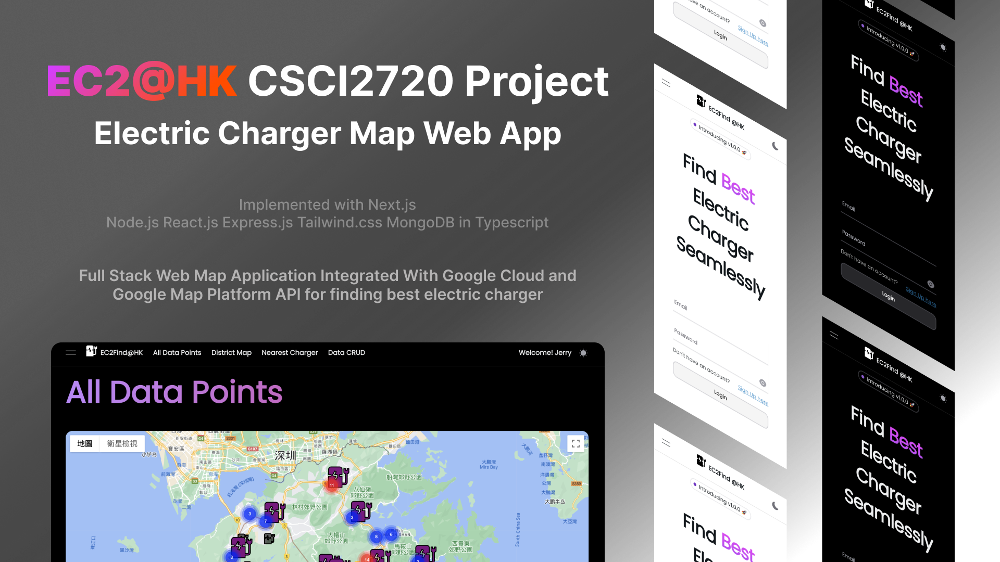

# CSCI 2720: EC2Find@HK



## Group Members

- So Tsz Chung 1155149485
- Chan Sik Lam 1155159276
- So Chin Ting 1155156676
- Tse Hui Tung 1155158864
- Yie Tin Hon 1155158824

## Installation & Environment Setup

0. #### Prerequisite
   Please ensure you have Node.js with npm or equivalent tools installed in your machine. Reference: https://docs.npmjs.com/downloading-and-installing-node-js-and-npm

1. #### (Optional) Install yarn with npm
   ```
   npm install --global yarn
   ```
   This will install yarn via npm globally. Reference: https://classic.yarnpkg.com/lang/en/docs/install/#mac-stable

2. #### Install required packages

   _Important: The script will install yarn globally, if you don't want to install yarn globally, please remove the line `npm install -g yarn` in `setup.sh`_

   Windows:

   ```
   ./setup.sh
   ```

   MacOS/Linux:

   ```
   source ./setup.sh
   ```

3. #### add .env file

   add .env file in ./backend (need your mongodb ac here, others can remain the same)
   
   ```
   DB_CONNECTION=<your mongo DB path>
   GOV_DATA_API=https://api.data.gov.hk/v1/nearest-clp-electric-vehicle-charging-stations
   DEV_SERVER_PATH=http://localhost:3000
   PORT=5500
   ```

   add .env file in ./frontend (can use the same )
   
   ```
   NEXT_PUBLIC_DEV_API_PATH=http://localhost:5500/
   NEXT_PUBLIC_GOOGLE_MAPS_API_KEY=<your google map api key>
   ```

## Start the project 

   ```
   yarn run dev
   ```

   run this command in `./csci2720` to start the frontend and backend concurrently

## Requirements

- node version >=v21.1.0
- yarn
- npm
